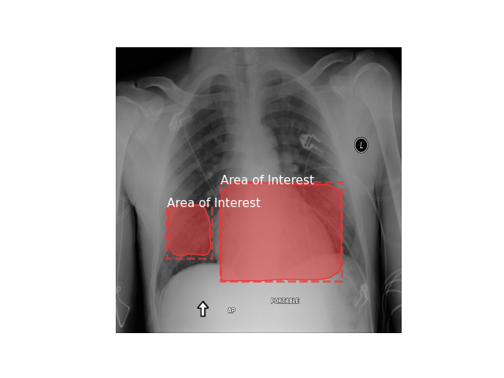

(this file is an updated version of `user_manual_draft.md` , which was renamed to properly display as a Readme file on GitLab)

# Deep MedIA Senior Design User Manual

Hello! This document will outline the steps needed to configure, train, and execute our systems. You first need to [run Jupyter from Bucknell's ACET machines](#ACET). You can then either [generate the models yourself](#generation) or use the saved models. Once you have the model, you can [run the model](#execution), either on the data set for evaluation or on custom images for classification and localization.

---
### Running a Jupyter Notebook from ACET Machines
To run one of our Jupyter notebooks, perform the following steps.

1. Access the ACET machines directly or through SSH (e.g. `ssh acet116-lnx-21.bucknell.edu`)
2. Run the command `module switch python/3.7-deeplearn` to load in all needed libraries and packages
3. Navigate to `src` folder and execute `./maskrcnn_setup.sh` to install (or more likely just downgrade) versions of tensorflow, keras, and many other modules that have specific version requirements to run Mask R-CNN
3. Navigate to `/bn-hpc/data/DeepMedIA`
4. Run a Jupyter instance. I use the command `jupyter lab --ip=0.0.0.0 --no-browser --allow-root --NotebookApp.token='' --NotebookApp.password='' --FileCheckpoints.checkpoint_dir='/home/abc123/jup-checkpoints/`, with `abc123` replaced with my Bucknell user ID. This will require a `jup-checkpoints` directory in your user home folder to already exist - if it doesn't, create it. The custom checkpoint directory a requirement 
5. (_Optional_) Disown the Jupyter process to avoid shutdown on terminal exit/disconnect. Find the process ID (the command `ps aux | grep /home/abc123/jup-checkpoints` should isolate it) and then run `disown [PID]`. This will allow you to connect remotely to the Jupyter notebook later without repeating any of the prior steps, as long as the computer isn't shut down.
6. Connect to the URL outputted to the terminal in Step 4 (e.g. http://acet116-lnx-21.bucknell.edu:8888/).

Congratulations! You have successfully connected to a Jupyter notebook and are ready to run the project! If you disowned the process in Step 5, you should only need Step 6 to reconnect to the project.

---

### Generating the Model

Notebook: [Generation](./src/training_testing/multi_label_classifier_clean.ipynb)

The generation notebook can be executed in full to generate a new model. The steps below will all be completed automatically, but it is recommended that you change the name of the model to be saved so that it does not overwrite any of the existing models.

#### Prerequisites:
You have the "Generation" notebook open in Jupyter with the `deeplearn` Python module active.

#### Model Generation
1. (_Optional_) Configure training parameters
2. Set up the model structure
3. Train the model
4. Review training results

Step 1 involves changing the second cell's variable values, and steps 2-4 can be performed by simply running all of the cells in order.

---

### Executing the project
Notebook: [Release](./src/final_release.py) 

Running the model is quite straightforward; the command `python final_release.py` will execute the classification script, allowing you to enter an image location. It will then classify the image according to which diseases are present and produce and produce a bounding box image via Mask R-CNN. The classification results will display to the console, while the bounding box image will be saved to `src/mrcnn_out_img`

---

### Expected Results
Notebook: [Evaluation](./src/training_testing/multi_label_class_roc.ipynb)

Below details an expected set of ROC curve results if our model were to be tested:

The below image shows a bounding box image generated via Mask R-CNN. This model cannot determine which disease in particular it has found, but it can find diseases to a high degree of accuracy, as is noted in each of our final reports. By using the classification results in tandem with the determined bounding boxes, useful inference can be made.

---

### Other folders within the file

1. `src/training_testing` - this folder contains the files used for generating new models and examining the results
2. `src/util` - contains many python functions and constants used in the other notebooks throughout the project
3. `src/dev_testing_notebooks` - old notebooks that are either outdated or were used solely for experimentation
4. `src/saved_models` - the model files used to load in our trained models
5. `src/mrcnn` - modules necessary for Mask R-CNN to run
6. `src/util` - general utility modules that provide functionality for the models
6. `src/test_imgs` - a few images that can be used for easy / quick testing

### Acknowledgements
The original dataset for our project can be found [here](https://www.kaggle.com/nih-chest-xrays/data).
This project was made by Andrew Dresser, Josh Dunbrack, Mitch Gavars, and Nicholas Passantino, and would not have been possible without the support of our professor and client Joshua Stough.